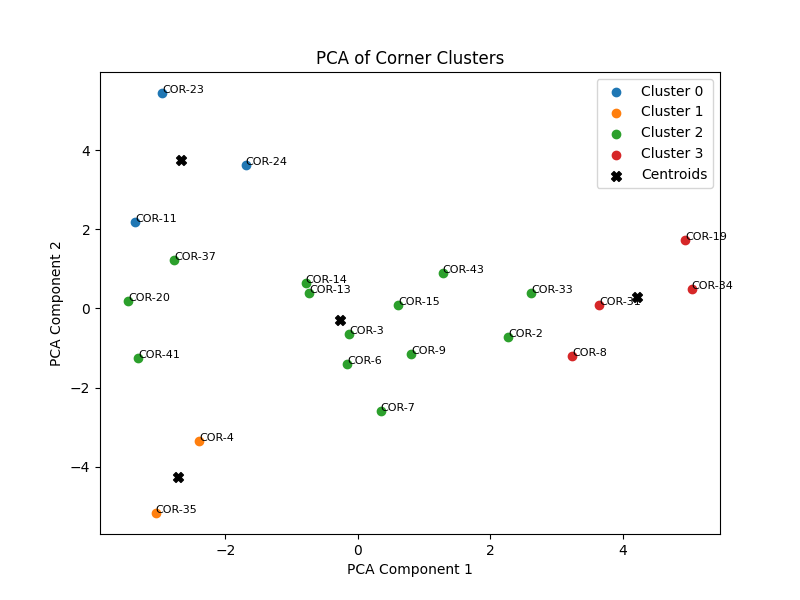

# Analysis of Arsenal's corners so far in the WSL in 2025/26

This data was collected by hand, watching games on YouTube. 

I use the following corner zones for data collection:


I have initially classified the corners into 4 groups: left vs right and front vs back post. However, the subsequent work will inform whether these groupings are right or not. 

We can plot the frequency of where corners are targeted at:


And where players are starting or ending their runs:


# Player roles and play diagrams

I defined roles for each player at each corner:

|Role name	|Description|
|-|-|
|Shot target|	A first receiver that is intended to take a shot|
|Pass target|	A first receiver that is intended to pass the |ball (e.g. flick on, head back across goal)
|Second target|	A second receiver that is intended to take a |shot
|Blocker	|A player who is deliberately blocking an opponent |from reaching an area
|Decoy	|A player who isn’t aiming to win the ball, only to |occupy a defender
|Mop up	|A player who is waiting for a breakaway or loose ball |away from the congested areas

Because I have collected the start and end locations of every player, we can plot a play diagram for each corner. 


# Clustering corners using player movement data

How do we know the four groups are correct? Is there a difference between left and right plays or are they just mirrored? Are there more subtle groupings between plays that we can infer from the data (instead of watching video for every corner)? We will try to use clustering to achieve this.

We will assume that the "mop up" role doesn't significantly affect the clustering. We will also assume the "pass target" role is functionally very similar to the "shot target" role, so we will replace it. 

We assume the corners can be mirrored, so we convert all right sided corners to left sided coordinates. The line of symmetry is x=40.

The cluster centroids are shown below, showing the "average" play for that cluster:


We can plot the corners in PCA space to try and visualise the clusters:



It can be difficult to get the clusters to be exactly right but using this is a good tool to get an initial idea of the data, without having to watch through every video and group them ourselves. 

# Play quality

We define a custom "play quality" metric to assess the quality of the play being run at the corner. It is the sum across all players involved at the corner of contributing to a shot, assuming the delivery is perfect. Each role has a value between 0 and 1, which is multiplied by a score for how they are marked (also between 0 and 1):

```py
ROLES = {
    "Shot target": 1,
    "Pass target": 0.5,
    "Second target": 0.5,
    "Blocker": 0.1,
    "Decoy": 0.1,
    "Mop up": 0.05,
}

MARKING = {
    "Free": 1,
    "Freed by blocker": 1,
    "Blocking": 1,
    "Gained separation": 0.8,
    "Goal marked": 0.3,
    "Watched zonally": 0.3,
    "Front marked": 0.1,
}
```

Now we have an objective measure of corner quality (excluding the delivery).

```
Corner Play Quality:
   Corner ID  Play quality
0     COR-11         2.945
16    COR-36         2.630
1     COR-12         2.225
10    COR-25         2.195
```

I would be wary of making any conclusions based on this small sample but one could imagine using this as a opposition scouting tool to identify the most important players at corners, as this metric accounts for their role and their ability to get into a favourable position.

```
Mean Player Play Quality:
           Player name  Mean play quality
14  Stina Blackstenius           0.432000
0        Alessia Russo           0.419200
13        Steph Catley           0.262609
3          Chloe Kelly           0.260000
10    Lotte Wubben Moy           0.250000
5         Frida Maanum           0.236071
7           Katie Reid           0.232500
2        Caitlin Foord           0.218438
```